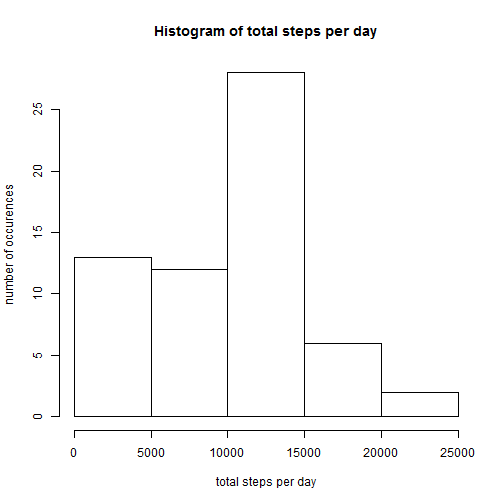
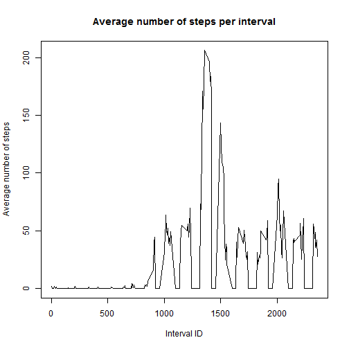
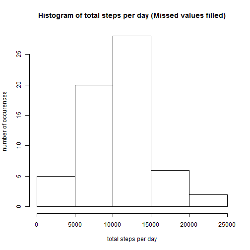
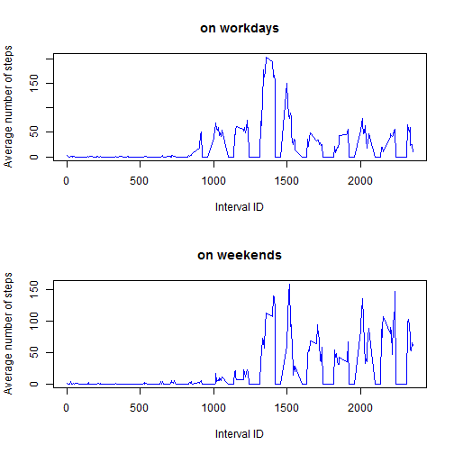

Reproducible Research: Peer Assessment 1 Report
===================================

---
title: "Reproducible Research: Peer Assessment 1"
output:
	html_document:
		keep_md: true
---

## Some basic info
* Input data for current research is quite small and is distributed along withthe code in file 
'activity.zip'
* Some reusable data-processing code is put into utility functions and held in file 'util_code.R'. 
No rocket-sciense in there, just examine those short routines for more details 

## __________________ To the tasks !!! ________________ 

### 1. Loading and preprocessing the data

```r
	DATA <- read.csv(unz("activity.zip", "activity.csv"))
	source('util_code.R');
```

### 2. What is mean total number of steps taken per day?

```r
	# split dataset to separate days and process each of them
	days = split(DATA, DATA$date);
	steps_per_day = unlist(lapply(days, steps_per_day_fun));
	
	# Plotting histogram of total steps per day
	windows();
	hist(steps_per_day, main = 'Histogram of total steps per day', 
		xlab = 'total steps per day', ylab = 'number of occurences');
```

 

```r
	# printing out results
	print(sprintf("Mean steps per day : %f", mean(steps_per_day)));
```

```
## [1] "Mean steps per day : 9354.229508"
```

```r
	print(sprintf("Median steps per day : %f", median(steps_per_day)));
```

```
## [1] "Median steps per day : 10395.000000"
```

### 3. What is the average daily activity pattern?

```r
	# calculate average number of steps per interval over all days
	avg_by_interval = calc_avg_steps_per_interval(DATA);
	interval_ids = days[[1]]$interval;
	
	# Plotting average number of steps per interval, calculated across all days
	windows();
	plot(avg_by_interval ~ interval_ids, type = 'n', main = 'Average number of steps per interval',
		xlab = 'Interval ID', ylab = 'Average number of steps');
	lines(avg_by_interval ~ interval_ids, col = 'black');
```

 

```r
	# Printing out interval with max average number of steps
	max_interval_id = interval_ids[which.max(avg_by_interval)];
	print( sprintf("Interval with biggest average number of steps: %d",max_interval_id) );
```

```
## [1] "Interval with biggest average number of steps: 1355"
```

### 4. Replacing missing values

```r
	# finding number of missing values
	num_missing = sum(is.na(DATA$steps));
	print( sprintf("Total number of missing values: %d", num_missing) );
```

```
## [1] "Total number of missing values: 2304"
```

```r
	# replacing missing values with averages numbers per interval
	values_fill_map = rep(avg_by_interval, length(days));
	values_fill_map = values_fill_map * as.numeric(is.na(DATA$steps));
	DATA$steps[is.na(DATA$steps)] = 0;
	DATA$steps <- DATA$steps + values_fill_map;

	# split updated dataset to separate days and process each of them
	days = split(DATA, DATA$date);
	steps_per_day = unlist(lapply(days, steps_per_day_fun));
	
	# Plotting histogram of total steps per day, calculated on data with filled missing values
	windows();
	hist(steps_per_day, main = 'Histogram of total steps per day (Missed values filled)', 
		xlab = 'total steps per day', ylab = 'number of occurences');
```

 

```r
	print(sprintf("Mean steps per day : %f (after filling missing values)", mean(steps_per_day)));
```

```
## [1] "Mean steps per day : 10224.974946 (after filling missing values)"
```

```r
	print(sprintf("Median steps per day : %f (after filling missing values)", median(steps_per_day)));
```

```
## [1] "Median steps per day : 10395.000000 (after filling missing values)"
```

### 5. Are there differences in activity patterns between weekdays and weekends?

```r
	# first of all - label our data with 'workday/weekend' labels	
	DATA = label_wd_we(DATA);
	
	# now split base dataset to one that contains WORKDAYS and one that contains WEEKENDS
	WD_DATA = DATA[DATA$weekday == 'workday',];
	WE_DATA = DATA[DATA$weekday == 'weekend',];
	
	# calculate average number of steps per interval for workdays and weekends
	wd_avg_by_interval = calc_avg_steps_per_interval(WD_DATA);
	we_avg_by_interval = calc_avg_steps_per_interval(WE_DATA);

	# Plotting average number of steps per interval, calucalted separately accross workdays and weekends
	windows();
	par(mfrow = c(2,1));
	plot(wd_avg_by_interval ~ interval_ids, main = 'on workdays', type="n",
		xlab = 'Interval ID', ylab = 'Average number of steps');
	lines(wd_avg_by_interval ~ interval_ids, col = 'blue');
	plot(we_avg_by_interval ~ interval_ids, main = 'on weekends', type="n",
		xlab = 'Interval ID', ylab = 'Average number of steps');
	lines(we_avg_by_interval ~ interval_ids, col = 'blue');
```

 
